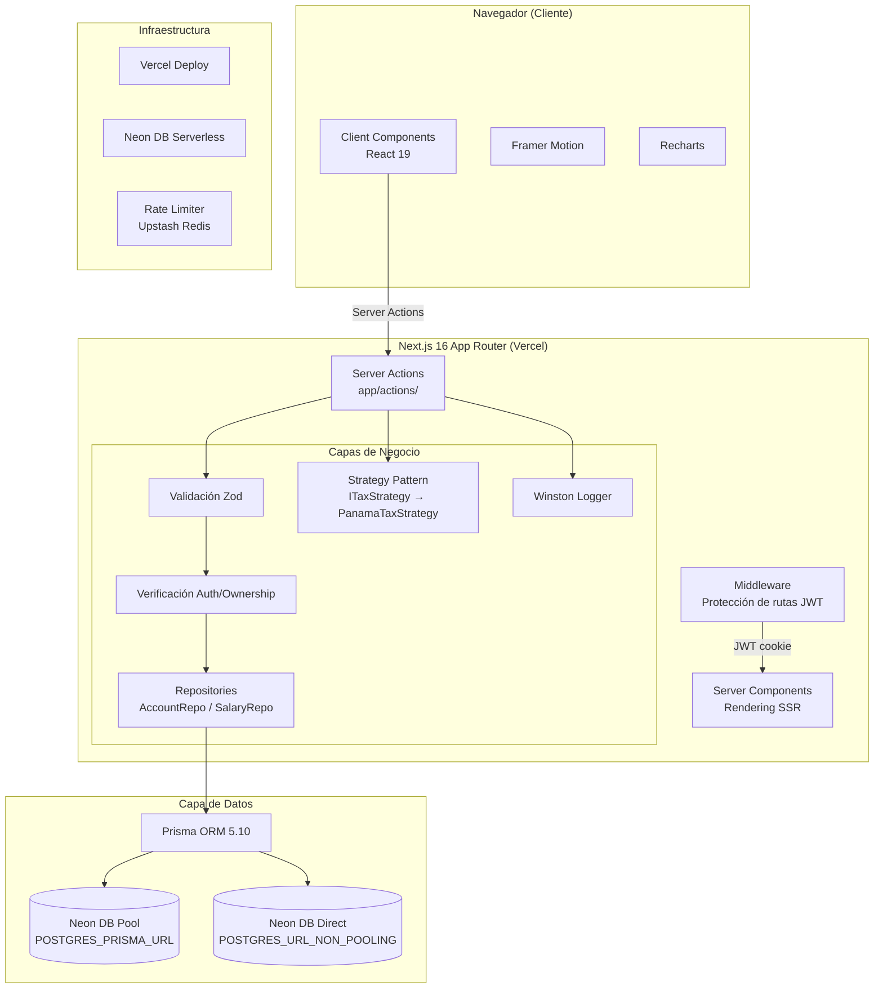
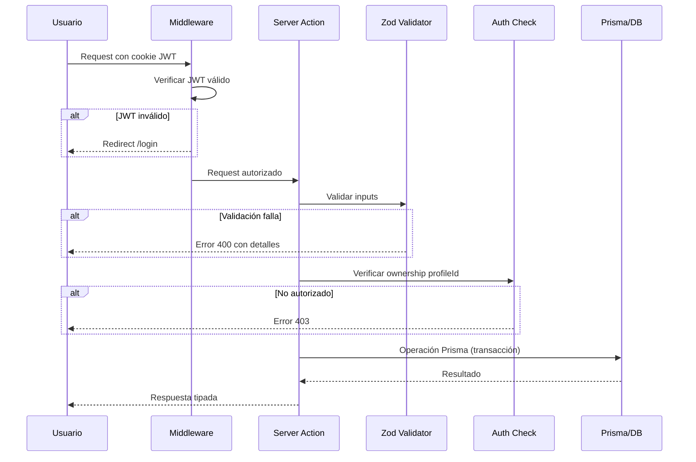

# Diseño Técnico — Finanzas Maestras

## Resumen Ejecutivo

Este documento describe la arquitectura técnica, decisiones de diseño, propiedades de corrección y estrategia de testing para **Finanzas Maestras**, una aplicación web de gestión de finanzas personales orientada al mercado panameño. Cubre el estado actual del sistema, las mejoras de seguridad de la Fase 9 y el roadmap de fases futuras.

---

## Visión General

Finanzas Maestras es una SPA/SSR híbrida construida sobre Next.js 16 App Router. El sistema permite a usuarios panameños gestionar salarios (con deducciones locales), cuentas bancarias, tarjetas de crédito, préstamos, metas de ahorro, presupuestos con sinking funds y categorías de gasto. Un módulo de administración permite impersonación de usuarios y auditoría de acciones.

### Principios de Diseño

- **Server-first**: lógica de negocio en Server Actions, no en API routes
- **Type-safety end-to-end**: TypeScript estricto + Zod para validación de fronteras
- **Security by default**: autenticación JWT, autorización por ownership, rate limiting
- **Auditabilidad**: AuditLog inmutable para todas las acciones administrativas
- **Extensibilidad**: patrones Repository y Strategy para facilitar nuevas implementaciones


---

## Arquitectura

### Diagrama de Alto Nivel



### Flujo de una Solicitud




---

## Componentes e Interfaces

### Frontend

#### Estructura de Rutas (App Router)

```
app/
├── (auth)/
│   ├── login/page.tsx
│   ├── register/page.tsx
│   └── claim/page.tsx
├── dashboard/
│   ├── layout.tsx          ← Layout con sidebar + theme
│   ├── page.tsx            ← Tab: Cuentas (default)
│   ├── budgets/page.tsx    ← Tab: Presupuestos
│   ├── cards/page.tsx      ← Tab: Tarjetas
│   ├── debts/page.tsx      ← Tab: Deudas
│   ├── expenses/page.tsx   ← Tab: Gastos
│   ├── income/page.tsx     ← Tab: Ingresos
│   ├── goals/page.tsx      ← Tab: Metas
│   └── insights/page.tsx   ← Tab: Insights
├── admin/
│   └── page.tsx            ← Panel admin (ADMIN only)
└── actions/                ← Server Actions
    ├── auth.ts
    ├── accounts.ts
    ├── expenses.ts
    ├── income.ts
    ├── salary.ts
    ├── goals.ts
    ├── cards.ts
    ├── loans.ts
    ├── categories.ts
    └── admin.ts
```

#### Componentes Principales

| Componente | Tipo | Descripción |
|---|---|---|
| `BudgetDashboard` | Client | Vista principal de presupuestos con gráficas Recharts |
| `AccountWizard` | Client | Wizard multi-paso para crear cuentas |
| `ExpenseWizard` | Client | Wizard para registrar gastos con categoría y método de pago |
| `IncomeWizard` | Client | Wizard para registrar ingresos adicionales |
| `SalaryCalculator` | Client | Calculadora de salario neto panameño con desglose de deducciones |
| `CategoryManager` | Client | CRUD de categorías con límites y configuración de sinking funds |
| `GoalTracker` | Client | Visualización de progreso de metas FIXED/VARIABLE |
| `LoanAmortization` | Client | Tabla de amortización y fecha de libertad financiera |
| `CreditCardManager` | Client | Gestión de tarjetas con cálculo de interés y anualidad |
| `InsightsDashboard` | Client | Gráficas de tendencias con Recharts + Framer Motion |
| `AdminPanel` | Client | Panel de impersonación y audit logs (ADMIN only) |
| `ThemeProvider` | Client | Proveedor de tema oscuro/claro con next-themes |

#### Interfaces TypeScript Clave

```typescript
// Resultado estándar de Server Action
interface ActionResult<T = void> {
  success: boolean;
  data?: T;
  error?: string;
  validationErrors?: Record<string, string[]>;
}

// Sesión de usuario en JWT payload
interface SessionPayload {
  profileId: string;
  email: string;
  role: 'USER' | 'ADMIN';
  impersonating?: string; // profileId del usuario impersonado
  iat: number;
  exp: number;
}

// Contexto de autorización para Server Actions
interface AuthContext {
  profileId: string;
  role: 'USER' | 'ADMIN';
  isImpersonating: boolean;
}
```

### Backend

#### Server Actions — Patrón de Implementación

Todas las Server Actions siguen este patrón estándar post-Fase 9:

```typescript
// app/actions/expenses.ts
'use server';

import { z } from 'zod';
import { getAuthContext } from '@/lib/auth';
import { rateLimiter } from '@/lib/rate-limiter';
import { prisma } from '@/lib/prisma';
import { logger } from '@/lib/logger';

const CreateExpenseSchema = z.object({
  amount: z.number().positive().max(999999.99),
  description: z.string().min(1).max(255),
  categoryId: z.string().cuid(),
  accountId: z.string().cuid().optional(),
  date: z.string().datetime(),
});

export async function createExpense(
  input: z.infer<typeof CreateExpenseSchema>
): Promise<ActionResult<Expense>> {
  // 1. Autenticación
  const auth = await getAuthContext();
  if (!auth) return { success: false, error: 'No autenticado' };

  // 2. Rate limiting
  await rateLimiter.check(auth.profileId, 'create-expense');

  // 3. Validación Zod
  const parsed = CreateExpenseSchema.safeParse(input);
  if (!parsed.success) {
    return { success: false, validationErrors: parsed.error.flatten().fieldErrors };
  }

  // 4. Verificación de ownership
  const category = await prisma.category.findUnique({ where: { id: parsed.data.categoryId } });
  if (!category || category.profileId !== auth.profileId) {
    return { success: false, error: 'No autorizado' };
  }

  // 5. Operación en transacción
  const expense = await prisma.$transaction(async (tx) => {
    return tx.expense.create({ data: { ...parsed.data, profileId: auth.profileId } });
  });

  logger.info('Expense created', { profileId: auth.profileId, expenseId: expense.id });
  return { success: true, data: expense };
}
```

#### Patrón Repository

```typescript
// lib/repositories/account.repository.ts
export class AccountRepository {
  async findByProfileId(profileId: string): Promise<Account[]> { ... }
  async findById(id: string, profileId: string): Promise<Account | null> { ... }
  async create(data: CreateAccountInput, profileId: string): Promise<Account> { ... }
  async updateBalance(id: string, delta: number, profileId: string): Promise<Account> { ... }
  async delete(id: string, profileId: string): Promise<void> { ... }
}
```

#### Strategy Pattern — Cálculo de Impuestos

```typescript
// lib/tax/interfaces.ts
export interface ITaxStrategy {
  calculateDeductions(grossSalary: number): TaxDeductions;
  getNetSalary(grossSalary: number): number;
}

// lib/tax/panama.strategy.ts
export class PanamaTaxStrategy implements ITaxStrategy {
  private readonly SS_RATE = 0.0975;       // Seguro Social 9.75%
  private readonly EDU_RATE = 0.0125;      // Educación 1.25%

  calculateDeductions(grossSalary: number): TaxDeductions {
    const ss = grossSalary * this.SS_RATE;
    const edu = grossSalary * this.EDU_RATE;
    const isr = this.calculateISR(grossSalary);
    const decimo = grossSalary / 12;       // Décimo tercer mes
    return { ss, edu, isr, decimo, total: ss + edu + isr };
  }

  private calculateISR(gross: number): number {
    // Tabla ISR panameña por tramos
    if (gross <= 11000) return 0;
    if (gross <= 50000) return (gross - 11000) * 0.15;
    return 5850 + (gross - 50000) * 0.25;
  }

  getNetSalary(grossSalary: number): number {
    const { total } = this.calculateDeductions(grossSalary);
    return grossSalary - total;
  }
}
```

#### Módulo de Autenticación

```typescript
// lib/auth.ts
import { SignJWT, jwtVerify } from 'jose';
import { cookies } from 'next/headers';

const JWT_SECRET = process.env.JWT_SECRET;
if (!JWT_SECRET || JWT_SECRET.length < 32) {
  throw new Error('JWT_SECRET debe estar definido y tener al menos 32 caracteres');
}
const SECRET_KEY = new TextEncoder().encode(JWT_SECRET);

export async function createSession(payload: SessionPayload): Promise<string> {
  return new SignJWT(payload)
    .setProtectedHeader({ alg: 'HS256' })
    .setExpirationTime('7d')
    .sign(SECRET_KEY);
}

export async function getAuthContext(): Promise<AuthContext | null> {
  const token = cookies().get('session')?.value;
  if (!token) return null;
  try {
    const { payload } = await jwtVerify(token, SECRET_KEY);
    return payload as AuthContext;
  } catch {
    return null;
  }
}
```


---

## Modelos de Datos

### Esquema Prisma — Modelos Principales

```prisma
model Profile {
  id           String   @id @default(cuid())
  email        String   @unique
  password     String   // bcryptjs hash, mínimo 8 chars
  name         String
  role         Role     @default(USER)
  accessCode   String?  @unique // 12 chars alfanumérico, expira 72h
  accessCodeExpiresAt DateTime?
  createdAt    DateTime @default(now())
  updatedAt    DateTime @updatedAt

  salaries         Salary[]
  additionalIncomes AdditionalIncome[]
  expenses         Expense[]
  categories       Category[]
  goals            Goal[]
  creditCards      CreditCard[]
  loans            Loan[]
  accounts         Account[]
  auditLogs        AuditLog[]
}

model Salary {
  id           String   @id @default(cuid())
  profileId    String
  grossSalary  Decimal  @db.Decimal(12, 2)
  netSalary    Decimal  @db.Decimal(12, 2)
  ssDeduction  Decimal  @db.Decimal(10, 2)  // 9.75%
  eduDeduction Decimal  @db.Decimal(10, 2)  // 1.25%
  isrDeduction Decimal  @db.Decimal(10, 2)
  decimoAmount Decimal  @db.Decimal(10, 2)
  createdAt    DateTime @default(now())
  profile      Profile  @relation(fields: [profileId], references: [id])
}

model Account {
  id           String      @id @default(cuid())
  profileId    String
  name         String
  type         AccountType // CHECKING | SAVINGS | CASH
  balance      Decimal     @db.Decimal(12, 2)
  lockedAmount Decimal     @db.Decimal(12, 2) @default(0)
  currency     String      @default("USD")
  createdAt    DateTime    @default(now())
  profile      Profile     @relation(fields: [profileId], references: [id])
  expenses     Expense[]
  transfersOut Transfer[]  @relation("TransferFrom")
  transfersIn  Transfer[]  @relation("TransferTo")
}

model Expense {
  id          String        @id @default(cuid())
  profileId   String
  accountId   String?
  categoryId  String
  amount      Decimal       @db.Decimal(10, 2)
  description String
  date        DateTime
  paymentMethod PaymentMethod
  createdAt   DateTime      @default(now())
  profile     Profile       @relation(fields: [profileId], references: [id])
  account     Account?      @relation(fields: [accountId], references: [id])
  category    Category      @relation(fields: [categoryId], references: [id])
}

model Category {
  id           String   @id @default(cuid())
  profileId    String
  name         String
  monthlyLimit Decimal? @db.Decimal(10, 2)
  rollover     Boolean  @default(false)
  sinkingFund  Boolean  @default(false)
  accumulated  Decimal  @db.Decimal(10, 2) @default(0)
  profile      Profile  @relation(fields: [profileId], references: [id])
  expenses     Expense[]
}

model Goal {
  id           String    @id @default(cuid())
  profileId    String
  name         String
  type         GoalType  // FIXED | VARIABLE
  targetAmount Decimal   @db.Decimal(12, 2)
  currentAmount Decimal  @db.Decimal(12, 2) @default(0)
  autoContribute Boolean @default(false)
  contributeAmount Decimal? @db.Decimal(10, 2)
  deadline     DateTime?
  profile      Profile   @relation(fields: [profileId], references: [id])
}

model AuditLog {
  id        String   @id @default(cuid())
  profileId String
  action    String
  entity    String
  entityId  String?
  metadata  Json?
  createdAt DateTime @default(now())
  profile   Profile  @relation(fields: [profileId], references: [id])
}
```

### Enumeraciones

```prisma
enum Role          { USER ADMIN }
enum AccountType   { CHECKING SAVINGS CASH }
enum GoalType      { FIXED VARIABLE }
enum PaymentMethod { CASH DEBIT CREDIT TRANSFER }
```

### Estrategia de Conexión a Neon DB

| Variable | Uso | Cuándo |
|---|---|---|
| `POSTGRES_PRISMA_URL` | Connection pooling (PgBouncer) | Server Actions, queries frecuentes |
| `POSTGRES_URL_NON_POOLING` | Conexión directa | Migraciones (`prisma migrate deploy`) |

### Índices y Performance

- Índices implícitos en todos los campos `@id` y `@unique`
- Índice recomendado en `Expense(profileId, date)` para queries de reportes
- Índice recomendado en `AuditLog(profileId, createdAt)` para paginación
- Uso de `Decimal` para todos los valores monetarios (evita errores de punto flotante)

### Migraciones

Las migraciones se gestionan en `prisma/migrations/`. El proceso de release ejecuta:

```bash
prisma migrate deploy && next start
```

Para la Fase 9, se requieren migraciones para:
1. Aumentar `accessCode` a 12 chars y agregar `accessCodeExpiresAt`
2. Agregar índices de performance en `Expense` y `AuditLog`


---

## Propiedades de Corrección

*Una propiedad es una característica o comportamiento que debe mantenerse verdadero en todas las ejecuciones válidas del sistema — esencialmente, una declaración formal sobre lo que el sistema debe hacer. Las propiedades sirven como puente entre las especificaciones legibles por humanos y las garantías de corrección verificables por máquinas.*

### Propiedad 1: Validación de longitud de JWT_SECRET

*Para cualquier* valor de `JWT_SECRET` con menos de 32 caracteres, el módulo de autenticación debe rechazar el arranque lanzando un error fatal antes de procesar cualquier solicitud.

**Valida: Requisito 2.3**

---

### Propiedad 2: Verificación de ownership en Server Actions

*Para cualquier* Server Action que opere sobre un recurso (Expense, Account, Category, Goal, etc.) y cualquier usuario autenticado, si el `profileId` del recurso no coincide con el `profileId` del usuario en sesión, la acción debe retornar error 403 sin ejecutar ninguna operación de base de datos.

**Valida: Requisitos 3.1, 3.2, 3.3, 3.4, 12.2**

---

### Propiedad 3: Protección de acciones exclusivas de ADMIN

*Para cualquier* Server Action marcada como exclusiva de ADMIN y cualquier usuario con rol USER, la acción debe ser rechazada con error de autorización independientemente del contenido de la solicitud.

**Valida: Requisito 3.5**

---

### Propiedad 4: Comportamiento de umbral del rate limiter

*Para cualquier* IP y cualquier endpoint protegido por rate limiting, si el número de solicitudes desde esa IP supera el umbral configurado (10 para login, 5 para registro, 5 para claim) dentro del período de tiempo definido, todas las solicitudes adicionales deben ser rechazadas con HTTP 429 hasta que expire el período de bloqueo.

**Valida: Requisitos 4.1, 4.2, 7.3, 12.3**

---

### Propiedad 5: Rate limiting registra en AuditLog

*Para cualquier* evento de bloqueo por rate limiting, el sistema debe crear una entrada en AuditLog con la IP bloqueada, el endpoint afectado y el timestamp del bloqueo.

**Valida: Requisito 4.4**

---

### Propiedad 6: Validación Zod rechaza inputs inválidos antes de la DB

*Para cualquier* Server Action y cualquier input que no cumpla el esquema Zod definido, la acción debe retornar los errores de validación al cliente sin ejecutar ninguna operación de lectura o escritura en la base de datos.

**Valida: Requisitos 5.2, 5.3, 12.4**

---

### Propiedad 7: Cobertura de validación de tipos de campo

*Para cualquier* campo de entrada con restricciones definidas (longitud máxima, formato de email, rango numérico, valor de enumeración), cualquier valor que viole esa restricción debe ser rechazado por el validador Zod con un mensaje de error específico para ese campo.

**Valida: Requisito 5.5**

---

### Propiedad 8: Expiración de cookie de impersonación

*Para cualquier* sesión de impersonación creada por un administrador, la cookie de impersonación debe tener un tiempo de expiración máximo de 2 horas desde el momento de su creación.

**Valida: Requisito 6.1**

---

### Propiedad 9: Auditoría completa de sesiones de impersonación

*Para cualquier* sesión de impersonación, el sistema debe crear entradas en AuditLog tanto al inicio como al fin de la sesión, incluyendo el `profileId` del administrador, el `profileId` del usuario impersonado y el timestamp correspondiente.

**Valida: Requisito 6.3**

---

### Propiedad 10: Formato y longitud de AccessCode

*Para cualquier* AccessCode generado por el sistema, debe tener exactamente 12 o más caracteres y estar compuesto únicamente por caracteres alfanuméricos (a-z, A-Z, 0-9).

**Valida: Requisito 7.1**

---

### Propiedad 11: AccessCode de uso único

*Para cualquier* AccessCode que haya sido utilizado exitosamente para reclamar un perfil, cualquier intento posterior de usar el mismo código debe ser rechazado con error de código inválido.

**Valida: Requisito 7.2**

---

### Propiedad 12: Expiración de AccessCode no utilizado

*Para cualquier* AccessCode creado hace más de 72 horas que no haya sido utilizado, cualquier intento de usarlo debe ser rechazado con error de código expirado.

**Valida: Requisito 7.4**

---

### Propiedad 13: Política de contraseñas

*Para cualquier* contraseña que no cumpla simultáneamente los tres criterios (mínimo 8 caracteres, al menos una mayúscula, al menos una minúscula, al menos un número), el módulo de autenticación debe rechazar la operación con un mensaje descriptivo indicando qué criterios no se cumplen.

**Valida: Requisitos 8.1, 8.2, 8.3**

---

### Propiedad 14: Consistencia de política de contraseñas

*Para cualquier* contraseña inválida según la política definida, el rechazo debe ocurrir de forma idéntica en las operaciones de registro, cambio de contraseña y reset de contraseña — la misma función de validación debe aplicarse en los tres contextos.

**Valida: Requisito 8.4**

---

### Propiedad 15: Rechazo de solicitudes no autenticadas

*Para cualquier* Server Action que requiera autenticación y cualquier solicitud sin cookie de sesión válida, la acción debe retornar error de no autenticado sin ejecutar ninguna operación de negocio ni acceder a la base de datos.

**Valida: Requisitos 12.1**


---

## Manejo de Errores

### Categorías de Error

| Categoría | Código HTTP | Descripción | Ejemplo |
|---|---|---|---|
| No autenticado | 401 | Sin sesión válida | Cookie expirada o ausente |
| No autorizado | 403 | Ownership mismatch o rol insuficiente | USER accediendo a acción ADMIN |
| Validación | 400 | Input no cumple esquema Zod | Email inválido, monto negativo |
| Rate limiting | 429 | Demasiadas solicitudes | >10 logins fallidos en 15 min |
| No encontrado | 404 | Recurso no existe | Expense con ID inexistente |
| Error interno | 500 | Error inesperado del servidor | Fallo de conexión a DB |

### Formato de Respuesta de Error

```typescript
// Respuesta de error estándar de Server Action
interface ErrorResponse {
  success: false;
  error: string;           // Mensaje legible por humanos
  code?: string;           // Código de error para el cliente (e.g., 'UNAUTHORIZED')
  validationErrors?: Record<string, string[]>; // Solo para errores de validación
  retryAfter?: number;     // Solo para 429, segundos hasta poder reintentar
}
```

### Estrategia de Logging de Errores

```typescript
// lib/logger.ts — Winston configurado por entorno
const logger = winston.createLogger({
  level: process.env.LOG_LEVEL || (process.env.NODE_ENV === 'production' ? 'warn' : 'info'),
  format: winston.format.combine(
    winston.format.timestamp(),
    winston.format.json()
  ),
  transports: [
    new winston.transports.Console(),
    new winston.transports.File({
      filename: 'logs/error.log',
      level: 'error',
      maxsize: 10 * 1024 * 1024, // 10MB
      maxFiles: 30,              // 30 días de retención
    }),
  ],
});

// NUNCA loggear: passwords, JWT tokens, datos financieros sensibles
// SÍ loggear: profileId, acción, timestamp, código de error
```

### Manejo de Errores de Prisma

```typescript
import { Prisma } from '@prisma/client';

function handlePrismaError(error: unknown): ErrorResponse {
  if (error instanceof Prisma.PrismaClientKnownRequestError) {
    if (error.code === 'P2002') {
      return { success: false, error: 'Ya existe un registro con ese valor único', code: 'DUPLICATE' };
    }
    if (error.code === 'P2025') {
      return { success: false, error: 'Registro no encontrado', code: 'NOT_FOUND' };
    }
  }
  logger.error('Unexpected DB error', { error });
  return { success: false, error: 'Error interno del servidor', code: 'INTERNAL_ERROR' };
}
```

### Validación de Variables de Entorno al Arranque

```typescript
// lib/env.ts — Ejecutado al iniciar la aplicación
const REQUIRED_ENV_VARS = [
  'DATABASE_URL',
  'POSTGRES_PRISMA_URL',
  'POSTGRES_URL_NON_POOLING',
  'JWT_SECRET',
] as const;

export function validateEnv(): void {
  const missing = REQUIRED_ENV_VARS.filter(key => !process.env[key]);
  if (missing.length > 0) {
    throw new Error(`Variables de entorno obligatorias no definidas: ${missing.join(', ')}`);
  }
  if (process.env.JWT_SECRET!.length < 32) {
    throw new Error('JWT_SECRET debe tener al menos 32 caracteres');
  }
}
```


---

## Estrategia de Testing

### Enfoque Dual: Tests Unitarios + Tests de Propiedades

La estrategia combina tests unitarios para casos concretos y tests de propiedades para verificar comportamiento universal. Ambos son complementarios y necesarios.

| Tipo | Herramienta | Propósito |
|---|---|---|
| Unitarios | Jest + ts-jest | Casos específicos, edge cases, integración entre componentes |
| Propiedades | fast-check (PBT) | Propiedades universales con inputs generados aleatoriamente |
| E2E | Playwright (futuro) | Flujos críticos de usuario en navegador real |

### Configuración de Jest

```typescript
// jest.config.ts
export default {
  preset: 'ts-jest',
  testEnvironment: 'node',
  collectCoverageFrom: [
    'lib/**/*.ts',
    'app/actions/**/*.ts',
    '!**/*.d.ts',
  ],
  coverageThreshold: {
    global: { lines: 60, functions: 60, branches: 60 },
  },
};
```

### Configuración de fast-check (Property-Based Testing)

```typescript
// Cada test de propiedad debe ejecutar mínimo 100 iteraciones
import fc from 'fast-check';

// Ejemplo de configuración global
fc.configureGlobal({ numRuns: 100 });
```

### Tests Unitarios — Casos Concretos

```typescript
// __tests__/auth/jwt-secret.test.ts
describe('JWT Secret Validation', () => {
  // Ejemplo E3: JWT_SECRET ausente causa error de arranque
  it('should throw when JWT_SECRET is not set', () => {
    delete process.env.JWT_SECRET;
    expect(() => validateEnv()).toThrow('JWT_SECRET');
  });

  // Ejemplo E3: JWT_SECRET de 31 chars es rechazado
  it('should throw when JWT_SECRET is less than 32 chars', () => {
    process.env.JWT_SECRET = 'a'.repeat(31);
    expect(() => validateEnv()).toThrow('32 caracteres');
  });
});

// __tests__/auth/security-headers.test.ts
describe('Security Headers', () => {
  // Ejemplo E5: Todas las cabeceras de seguridad presentes
  it('should include all required security headers', async () => {
    const response = await fetch('http://localhost:3000/');
    expect(response.headers.get('x-frame-options')).toBe('DENY');
    expect(response.headers.get('x-content-type-options')).toBe('nosniff');
    expect(response.headers.get('content-security-policy')).toBeTruthy();
    expect(response.headers.get('referrer-policy')).toBe('strict-origin-when-cross-origin');
  });
});

// __tests__/auth/password-policy.test.ts
describe('Password Policy Error Messages', () => {
  // Ejemplo E6: Mensaje descriptivo de política de contraseñas
  it('should return descriptive error for password missing uppercase', () => {
    const result = validatePassword('password1');
    expect(result.errors).toContain('mayúscula');
  });
});
```

### Tests de Propiedades — Propiedades Universales

```typescript
// __tests__/properties/auth.property.test.ts
import fc from 'fast-check';

// Feature: project-status-roadmap, Property 1: JWT_SECRET length validation
describe('Property 1: JWT_SECRET length validation', () => {
  it('should reject any JWT_SECRET shorter than 32 chars', () => {
    fc.assert(fc.property(
      fc.string({ maxLength: 31 }),
      (shortSecret) => {
        process.env.JWT_SECRET = shortSecret;
        expect(() => validateEnv()).toThrow();
      }
    ), { numRuns: 100 });
  });
});

// Feature: project-status-roadmap, Property 2: Ownership verification in Server Actions
describe('Property 2: Ownership verification in Server Actions', () => {
  it('should reject any request where profileId does not match session', () => {
    fc.assert(fc.property(
      fc.record({ profileId: fc.string(), resourceProfileId: fc.string() })
        .filter(({ profileId, resourceProfileId }) => profileId !== resourceProfileId),
      async ({ profileId, resourceProfileId }) => {
        const result = await deleteExpense({ expenseId: 'any', sessionProfileId: profileId, resourceProfileId });
        expect(result.success).toBe(false);
        expect(result.error).toMatch(/autorizado|403/i);
      }
    ), { numRuns: 100 });
  });
});

// Feature: project-status-roadmap, Property 3: ADMIN-only action protection
describe('Property 3: ADMIN-only action protection', () => {
  it('should reject any USER role from accessing ADMIN-only actions', () => {
    fc.assert(fc.property(
      fc.record({ profileId: fc.string(), role: fc.constant('USER') }),
      async (userSession) => {
        const result = await getAuditLogs({ session: userSession });
        expect(result.success).toBe(false);
      }
    ), { numRuns: 100 });
  });
});

// Feature: project-status-roadmap, Property 4: Rate limiting threshold behavior
describe('Property 4: Rate limiting threshold behavior', () => {
  it('should block requests exceeding the configured threshold', () => {
    fc.assert(fc.property(
      fc.record({
        ip: fc.ipV4(),
        endpoint: fc.constantFrom('login', 'register', 'claim'),
        extraAttempts: fc.integer({ min: 1, max: 20 }),
      }),
      async ({ ip, endpoint, extraAttempts }) => {
        const threshold = { login: 10, register: 5, claim: 5 }[endpoint];
        // Exhaust the limit
        for (let i = 0; i < threshold; i++) {
          await rateLimiter.increment(ip, endpoint);
        }
        // Any additional attempt should be blocked
        for (let i = 0; i < extraAttempts; i++) {
          const allowed = await rateLimiter.check(ip, endpoint);
          expect(allowed).toBe(false);
        }
      }
    ), { numRuns: 100 });
  });
});

// Feature: project-status-roadmap, Property 5: Rate limiting creates AuditLog
describe('Property 5: Rate limiting creates AuditLog entry', () => {
  it('should create AuditLog entry for every rate limit block event', () => {
    fc.assert(fc.property(
      fc.record({ ip: fc.ipV4(), endpoint: fc.constantFrom('login', 'register') }),
      async ({ ip, endpoint }) => {
        const before = await countAuditLogs({ action: 'RATE_LIMIT_BLOCK' });
        await triggerRateLimitBlock(ip, endpoint);
        const after = await countAuditLogs({ action: 'RATE_LIMIT_BLOCK' });
        expect(after).toBe(before + 1);
      }
    ), { numRuns: 100 });
  });
});

// Feature: project-status-roadmap, Property 6: Zod validation rejects invalid inputs before DB
describe('Property 6: Zod validation rejects invalid inputs before DB', () => {
  it('should reject any input that fails Zod schema without touching DB', () => {
    fc.assert(fc.property(
      fc.record({
        amount: fc.oneof(fc.constant(-1), fc.constant(0), fc.string()),
        description: fc.constant(''),
        categoryId: fc.constant('not-a-cuid'),
      }),
      async (invalidInput) => {
        const dbCallsBefore = getDbCallCount();
        const result = await createExpense(invalidInput as any);
        expect(result.success).toBe(false);
        expect(result.validationErrors).toBeDefined();
        expect(getDbCallCount()).toBe(dbCallsBefore); // No DB calls
      }
    ), { numRuns: 100 });
  });
});

// Feature: project-status-roadmap, Property 7: Zod validates all constraint types
describe('Property 7: Zod validates all constraint types', () => {
  it('should reject any field value that violates its constraint', () => {
    fc.assert(fc.property(
      fc.oneof(
        fc.record({ email: fc.string().filter(s => !s.includes('@')) }),
        fc.record({ amount: fc.float({ min: -999999, max: -0.01 }) }),
        fc.record({ name: fc.string({ minLength: 256 }) }),
      ),
      async (invalidField) => {
        const result = await validateWithZod(invalidField);
        expect(result.success).toBe(false);
      }
    ), { numRuns: 100 });
  });
});

// Feature: project-status-roadmap, Property 8: Impersonation cookie expiration <= 2h
describe('Property 8: Impersonation cookie expiration', () => {
  it('should always set impersonation cookie with expiration <= 2 hours', () => {
    fc.assert(fc.property(
      fc.record({ adminId: fc.string(), targetUserId: fc.string() }),
      async ({ adminId, targetUserId }) => {
        const cookie = await createImpersonationCookie(adminId, targetUserId);
        const expiresIn = cookie.expires - Date.now();
        expect(expiresIn).toBeLessThanOrEqual(2 * 60 * 60 * 1000);
        expect(expiresIn).toBeGreaterThan(0);
      }
    ), { numRuns: 100 });
  });
});

// Feature: project-status-roadmap, Property 9: Impersonation creates AuditLog entries
describe('Property 9: Impersonation AuditLog round-trip', () => {
  it('should create AuditLog entries for both start and end of impersonation', () => {
    fc.assert(fc.property(
      fc.record({ adminId: fc.string(), targetUserId: fc.string() }),
      async ({ adminId, targetUserId }) => {
        await startImpersonation(adminId, targetUserId);
        await endImpersonation(adminId, targetUserId);
        const logs = await getAuditLogs({ action: 'IMPERSONATION', adminId });
        const startLog = logs.find(l => l.metadata?.event === 'START');
        const endLog = logs.find(l => l.metadata?.event === 'END');
        expect(startLog).toBeDefined();
        expect(endLog).toBeDefined();
      }
    ), { numRuns: 100 });
  });
});

// Feature: project-status-roadmap, Property 10: AccessCode format and length
describe('Property 10: AccessCode format and length', () => {
  it('should always generate AccessCodes with >= 12 alphanumeric characters', () => {
    fc.assert(fc.property(
      fc.constant(null), // No input needed, just generate
      () => {
        const code = generateAccessCode();
        expect(code.length).toBeGreaterThanOrEqual(12);
        expect(code).toMatch(/^[a-zA-Z0-9]+$/);
      }
    ), { numRuns: 100 });
  });
});

// Feature: project-status-roadmap, Property 11: AccessCode single-use invalidation
describe('Property 11: AccessCode single-use invalidation', () => {
  it('should reject any AccessCode that has already been used', () => {
    fc.assert(fc.property(
      fc.record({ profileId: fc.string() }),
      async ({ profileId }) => {
        const code = generateAccessCode();
        await claimProfile(profileId, code); // First use — succeeds
        const secondAttempt = await claimProfile(profileId, code); // Second use
        expect(secondAttempt.success).toBe(false);
      }
    ), { numRuns: 100 });
  });
});

// Feature: project-status-roadmap, Property 12: AccessCode expiration
describe('Property 12: AccessCode expiration after 72 hours', () => {
  it('should reject any AccessCode created more than 72 hours ago', () => {
    fc.assert(fc.property(
      fc.integer({ min: 73, max: 8760 }), // hours past expiration
      async (hoursAgo) => {
        const expiredCode = await createAccessCodeWithAge(hoursAgo);
        const result = await claimProfile('any-profile', expiredCode);
        expect(result.success).toBe(false);
        expect(result.error).toMatch(/expirado/i);
      }
    ), { numRuns: 100 });
  });
});

// Feature: project-status-roadmap, Property 13: Password policy
describe('Property 13: Password policy enforcement', () => {
  it('should reject any password that fails complexity requirements', () => {
    fc.assert(fc.property(
      fc.oneof(
        fc.string({ maxLength: 7 }),                          // Too short
        fc.string().filter(s => s === s.toLowerCase()),       // No uppercase
        fc.string().filter(s => s === s.toUpperCase()),       // No lowercase
        fc.string().filter(s => !/\d/.test(s)),               // No digit
      ),
      (weakPassword) => {
        const result = validatePassword(weakPassword);
        expect(result.valid).toBe(false);
        expect(result.errors.length).toBeGreaterThan(0);
      }
    ), { numRuns: 100 });
  });
});

// Feature: project-status-roadmap, Property 14: Password policy consistency
describe('Property 14: Password policy consistency across operations', () => {
  it('should apply identical validation in register, change password, and reset password', () => {
    fc.assert(fc.property(
      fc.string({ maxLength: 7 }), // Always invalid (too short)
      async (weakPassword) => {
        const registerResult = await register({ email: 'test@test.com', password: weakPassword });
        const changeResult = await changePassword({ oldPassword: 'Valid1pass', newPassword: weakPassword });
        const resetResult = await resetPassword({ token: 'any', newPassword: weakPassword });
        // All three must reject
        expect(registerResult.success).toBe(false);
        expect(changeResult.success).toBe(false);
        expect(resetResult.success).toBe(false);
      }
    ), { numRuns: 100 });
  });
});

// Feature: project-status-roadmap, Property 15: Unauthenticated requests rejected
describe('Property 15: Unauthenticated requests rejected', () => {
  it('should reject any Server Action call without a valid session cookie', () => {
    fc.assert(fc.property(
      fc.constantFrom(
        () => createExpense({ amount: 10, description: 'test', categoryId: 'id', date: new Date().toISOString() }),
        () => deleteExpense({ expenseId: 'id' }),
        () => createAccount({ name: 'test', type: 'CHECKING', balance: 0 }),
      ),
      async (action) => {
        clearSessionCookie();
        const result = await action();
        expect(result.success).toBe(false);
        expect(result.error).toMatch(/autenticado|sesión/i);
      }
    ), { numRuns: 100 });
  });
});
```

### Estructura de Archivos de Tests

```
__tests__/
├── unit/
│   ├── financial-engine.test.ts     ← Existente: 4 tests del motor de salario
│   ├── salary-calculator.test.ts    ← SS, Educación, ISR, Décimo
│   ├── access-code.test.ts          ← Generación y validación de AccessCode
│   └── password-policy.test.ts      ← Política de contraseñas
├── integration/
│   ├── auth-actions.test.ts         ← login, register, logout
│   ├── expense-actions.test.ts      ← CRUD de gastos con ownership
│   └── admin-actions.test.ts        ← Impersonación y audit logs
├── security/
│   ├── authorization.test.ts        ← Ownership y roles
│   ├── rate-limiting.test.ts        ← Umbrales de rate limiting
│   └── security-headers.test.ts     ← Cabeceras HTTP de seguridad
└── properties/
    └── auth.property.test.ts        ← 15 propiedades PBT con fast-check
```

### Cobertura Objetivo

| Módulo | Cobertura Mínima |
|---|---|
| `lib/auth.ts` | 80% |
| `lib/tax/` | 90% |
| `lib/repositories/` | 70% |
| `app/actions/` | 60% |
| `lib/validators/` | 85% |
| Global | 60% |


---

## Seguridad — Plan de Remediación

### Vulnerabilidades Críticas (Inmediato)

| ID | Vulnerabilidad | Severidad | Acción |
|---|---|---|---|
| SEC-01 | `.env` commiteado con credenciales reales | CRÍTICO | Rotar credenciales + BFG Repo Cleaner + agregar a .gitignore |
| SEC-02 | `JWT_SECRET` con fallback hardcodeado | CRÍTICO | Eliminar fallback + validación obligatoria al arranque |
| SEC-03 | Sin verificación de ownership en Server Actions | ALTO | Implementar `getAuthContext()` + verificación en cada action |
| SEC-04 | Sin rate limiting en autenticación | ALTO | Implementar con Upstash Redis o `@upstash/ratelimit` |
| SEC-05 | Sin validación Zod en Server Actions | ALTO | Definir esquemas Zod para todos los inputs |
| SEC-06 | AccessCode de 6 chars (fuerza bruta posible) | MEDIO | Aumentar a 12 chars + `crypto.randomBytes()` |
| SEC-07 | Cookie de impersonación sin expiración | MEDIO | Agregar `maxAge: 7200` (2 horas) |
| SEC-08 | Sin cabeceras CSP | MEDIO | Configurar en `next.config.ts` |
| SEC-09 | Política de contraseñas débil (4 chars) | MEDIO | Aumentar a 8 chars + complejidad |
| SEC-10 | Archivos de debug en raíz | BAJO | Eliminar `check_roles.ts`, `debug-net-worth.ts` |

### Implementación de Rate Limiting

```typescript
// lib/rate-limiter.ts — usando @upstash/ratelimit
import { Ratelimit } from '@upstash/ratelimit';
import { Redis } from '@upstash/redis';

const redis = Redis.fromEnv();

export const rateLimiters = {
  login: new Ratelimit({
    redis,
    limiter: Ratelimit.slidingWindow(10, '15 m'),
    prefix: 'rl:login',
  }),
  register: new Ratelimit({
    redis,
    limiter: Ratelimit.slidingWindow(5, '60 m'),
    prefix: 'rl:register',
  }),
  claim: new Ratelimit({
    redis,
    limiter: Ratelimit.slidingWindow(5, '60 m'),
    prefix: 'rl:claim',
  }),
};
```

### Cabeceras de Seguridad (next.config.ts)

```typescript
// next.config.ts
const securityHeaders = [
  { key: 'X-Frame-Options', value: 'DENY' },
  { key: 'X-Content-Type-Options', value: 'nosniff' },
  { key: 'Referrer-Policy', value: 'strict-origin-when-cross-origin' },
  { key: 'Strict-Transport-Security', value: 'max-age=63072000; includeSubDomains; preload' },
  {
    key: 'Content-Security-Policy',
    value: [
      "default-src 'self'",
      "script-src 'self' 'unsafe-inline'",  // unsafe-inline requerido por Next.js
      "style-src 'self' 'unsafe-inline'",
      "img-src 'self' data: blob:",
      "font-src 'self'",
      "connect-src 'self'",
      "frame-ancestors 'none'",
    ].join('; '),
  },
];
```

---

## DevOps y Despliegue

### Estado Actual

| Componente | Estado | Herramienta |
|---|---|---|
| Deploy | ✅ Activo | Vercel (producción) |
| Base de datos | ✅ Activo | Neon DB (serverless PostgreSQL) |
| CI/CD | ❌ No configurado | — |
| Staging | ❌ No existe | — |
| Error tracking | ❌ No configurado | — |
| Monitoreo | ❌ No configurado | — |

### Plan de Mejoras DevOps

#### GitHub Actions (CI)

```yaml
# .github/workflows/ci.yml
name: CI
on: [push, pull_request]
jobs:
  ci:
    runs-on: ubuntu-latest
    steps:
      - uses: actions/checkout@v4
      - uses: actions/setup-node@v4
        with: { node-version: '20' }
      - run: npm ci
      - run: npm run lint
      - run: npm run type-check
      - run: npm test -- --coverage --ci
      - run: npm run build
```

#### Entornos de Vercel

| Entorno | Branch | Base de datos | Variables |
|---|---|---|---|
| Producción | `main` | Neon DB prod | Vercel Dashboard (prod) |
| Staging | `develop` | Neon DB staging | Vercel Dashboard (preview) |
| Preview | PRs | Neon DB dev | Vercel Dashboard (preview) |

#### Herramientas Recomendadas

- **Sentry**: Error tracking y performance monitoring
- **Vercel Analytics**: Web vitals y métricas de uso
- **Upstash Redis**: Rate limiting y caché de sesiones
- **GitHub Actions**: CI/CD automatizado

### Variables de Entorno Requeridas

```bash
# .env.example
# Base de datos (Neon DB)
POSTGRES_PRISMA_URL=postgresql://...?pgbouncer=true&connect_timeout=15
POSTGRES_URL_NON_POOLING=postgresql://...

# Autenticación
JWT_SECRET=<mínimo 32 caracteres aleatorios>

# Rate Limiting (Upstash Redis)
UPSTASH_REDIS_REST_URL=https://...
UPSTASH_REDIS_REST_TOKEN=...

# Logging
LOG_LEVEL=warn  # error | warn | info | debug

# Opcional: Error tracking
SENTRY_DSN=https://...
NEXT_PUBLIC_SENTRY_DSN=https://...
```

---

## Roadmap de Fases Futuras

### Fase 10: Notificaciones y Alertas

- Modelo `Notification` en DB con tipos: BUDGET_WARNING (80%), BUDGET_EXCEEDED (100%), GOAL_MISSED
- Job programado (Vercel Cron) para evaluar límites diariamente
- Canal email con Resend o SendGrid
- Preferencias de notificación por usuario

### Fase 11: Soporte Multi-Moneda

- Campo `currency` en `Expense`, `AdditionalIncome`, `Transfer`
- Campo `exchangeRate` para conversión a moneda base
- API de tipos de cambio (Fixer.io o similar)
- Moneda base configurable por usuario (default: USD)

### Fase 12: Reportes y Exportación

- Exportación CSV con filtros de fecha y categoría
- Generación PDF con `@react-pdf/renderer` o Puppeteer
- Reporte mensual automático vía email
- AuditLog de exportaciones

### Fase 13: PWA

- Service Worker con Workbox para caché offline
- `manifest.json` con íconos y configuración de instalación
- Indicador de modo offline en UI
- Sincronización automática al recuperar conexión

### Fase 14: Presupuesto por Período Flexible

- Enum `BudgetPeriod`: WEEKLY | BIWEEKLY | MONTHLY | QUARTERLY | ANNUAL
- Cálculo prorrateado de límites por período
- Ajuste de rollover/sinking fund al período configurado

### Fase 15: Open Banking

- Integración con proveedor compatible con bancos panameños
- Sugerencia de categorías basada en historial
- Flujo de revisión y confirmación de transacciones importadas
- Almacenamiento cifrado de tokens bancarios (AES-256)
- Revocación de acceso desde configuración de usuario

