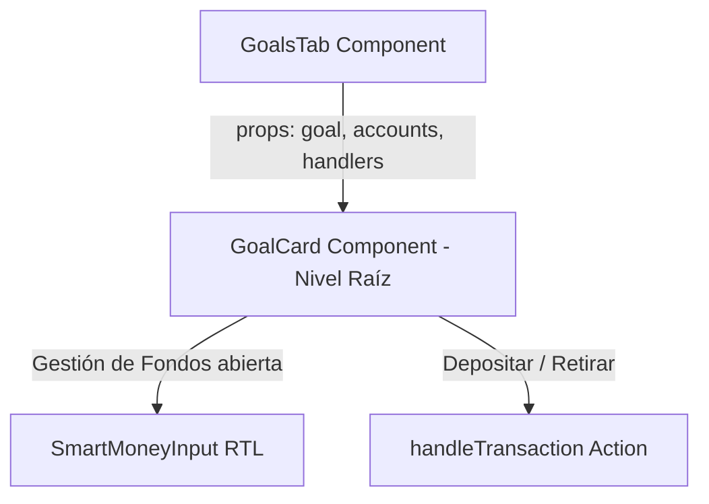

# Decisiones de Diseño y Arquitectura - Refactorización GoalCard

## 1. Arquitectura de Componentes
### Situación previa
`GoalsTab.tsx` contenía `function GoalCard(...)` anidada en el cuerpo de `function GoalsTab(...)`. Esta práctica viola el ciclo de renderizado de React:
- Al mutar `transactionAmount` en el padre, `GoalsTab` se re-renderiza y crea una nueva instancia de la función `GoalCard`.
- React detecta un tipo de componente nuevo en `<GoalCard key={goal.id} />` y destruye/reconstruye el subárbol del DOM, perdiendo el foco y el estado efímero del input.

### Solución Arquitectónica
1. **Extracción de `GoalCard`:**
   - Mover la definición de `GoalCard` fuera del alcance de la función `GoalsTab` (en el mismo archivo o modularizada como componente exportado/independiente).
   - Recibir handlers y datos explícitos como props (`goal`, `accounts`, `onOpenHistory`, `onPause`, `onOpenEdit`, `onSmartDelete`, `onTransaction`).
2. **Estandarización de Entrada Numérica:**
   - Reemplazar el `<input type="text">` nativo con `<SmartMoneyInput>` en la sección "Gestionar Fondos".
   - `SmartMoneyInput` asegura entrada decimal derecha-a-izquierda (RTL), formateo exacto de 2 decimales y compatibilidad móvil unificada.
3. **Manejo de Estado de Transacción:**
   - Mantener el control de apertura mediante `expandedGoalId` o aislar el estado de `transactionAmount` y `selectedAccountId` a nivel de tarjeta individual cuando esté expandida, evitando colisiones de estado entre tarjetas.

## 2. Diagrama de Flujo y Jerarquía

