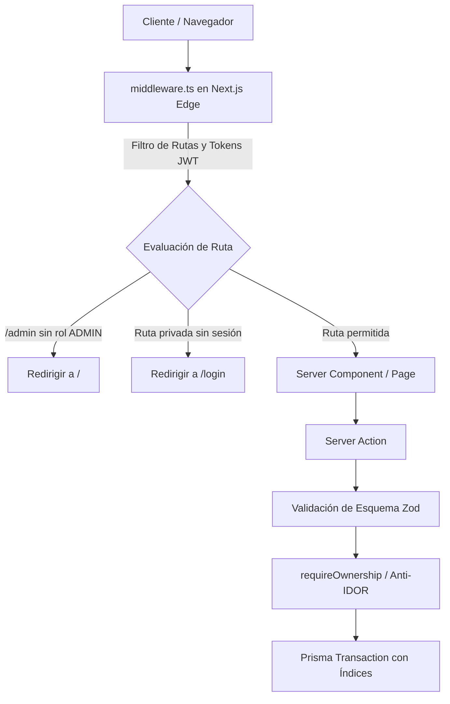

# Decisiones de Diseño y Arquitectura — Plan Maestro Global

## 1. Arquitectura de Seguridad y Flujo de Peticiones



## 2. Decisiones de Diseño Clave

### A. Módulo de Validación de Entorno (`lib/env.ts`)
- Implementar validación Fail-Fast: la aplicación no arranca si faltan secretos esenciales o si `JWT_SECRET` es menor a 32 caracteres.

### B. Corrección Algorítmica en el Motor Financiero (`lib/financial-engine.ts`)
- **Mejor día de compra:**
  ```typescript
  if (currentDay > cutoffDay) {
    // Si ya pasó el corte este mes, el mejor día es el día después del corte del mes siguiente
    bestDayDate = new Date(currentYear, currentMonth + 1, cutoffDay + 1);
  } else {
    // Si el corte aún no ha ocurrido, el mejor día fue o será cutoffDay + 1
    bestDayDate = new Date(currentYear, currentMonth, cutoffDay + 1);
  }
  ```

### C. Desacoplamiento de Mutaciones en Server Components
- El Server Component `app/page.tsx` debe ser **idempotente y de solo lectura**.
- La creación de la cuenta 'Efectivo' y categorías iniciales se encapsula en una función de servicio invocada únicamente en `register()` o mediante una Server Action explícita de onboarding.

### D. Indexación en Base de Datos (`prisma/schema.prisma`)
- En PostgreSQL sobre Neon DB, agregar índices explícitos:
  - `Expense`: `@@index([profileId])`, `@@index([accountId])`, `@@index([categoryId])`, `@@index([createdAt])`
  - `Account`: `@@index([profileId])`
  - `Goal`: `@@index([profileId])`
  - `CreditCard`: `@@index([profileId])`
  - `Loan`: `@@index([profileId])`
  - `Transfer`: `@@index([sourceAccountId])`, `@@index([destinationAccountId])`

### E. Modularización de la UI bajo SRP
- Subdividir `DebtsTab.tsx` en `components/dashboard/tabs/debts/`:
  - `LoanCard.tsx`
  - `CreditCardCard.tsx`
  - `DebtModal.tsx`
  - `AmortizationScheduleModal.tsx`
