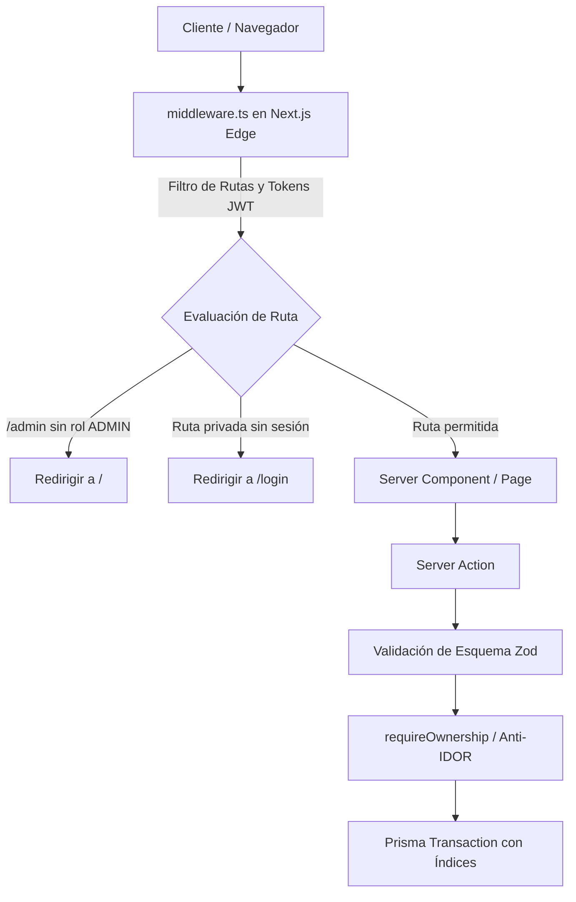

# Decisiones de Diseño y Arquitectura — Plan Maestro Global

## 1. Arquitectura de Seguridad y Flujo de Peticiones



## 2. Decisiones de Diseño Clave

### A. Módulo de Validación de Entorno (`lib/env.ts`)
- Implementar validación Fail-Fast: la aplicación no arranca si faltan secretos esenciales o si `JWT_SECRET` es menor a 32 caracteres.

### B. Corrección Algorítmica en el Motor Financiero (`lib/financial-engine.ts`)
- **Mejor día de compra:**
  ```typescript
  if (currentDay > cutoffDay) {
    // Si ya pasó el corte este mes, el mejor día es el día después del corte del mes siguiente
    bestDayDate = new Date(currentYear, currentMonth + 1, cutoffDay + 1);
  } else {
    // Si el corte aún no ha ocurrido, el mejor día fue o será cutoffDay + 1
    bestDayDate = new Date(currentYear, currentMonth, cutoffDay + 1);
  }
  ```

### C. Desacoplamiento de Mutaciones en Server Components
- El Server Component `app/page.tsx` debe ser **idempotente y de solo lectura**.
- La creación de la cuenta 'Efectivo' y categorías iniciales se encapsula en una función de servicio invocada únicamente en `register()` o mediante una Server Action explícita de onboarding.

### D. Indexación en Base de Datos (`prisma/schema.prisma`)
- En PostgreSQL sobre Neon DB, agregar índices explícitos:
  - `Expense`: `@@index([profileId])`, `@@index([accountId])`, `@@index([categoryId])`, `@@index([createdAt])`
  - `Account`: `@@index([profileId])`
  - `Goal`: `@@index([profileId])`
  - `CreditCard`: `@@index([profileId])`
  - `Loan`: `@@index([profileId])`
  - `Transfer`: `@@index([sourceAccountId])`, `@@index([destinationAccountId])`

### E. Modularización de la UI bajo SRP
- Subdividir `DebtsTab.tsx` en `components/dashboard/tabs/debts/`:
  - `LoanCard.tsx`
  - `CreditCardCard.tsx`
  - `DebtModal.tsx`
  - `AmortizationScheduleModal.tsx`

---

## Decisiones tomadas durante la revisión de integridad y del primer uso

### F. Todo movimiento de dinero pasa por `lib/ledger.ts`

Los helpers `decrementAccountBalance`, `decrementCreditCardBalance` y
`decrementLoanBalance` hacen un UPDATE condicionado (`WHERE saldo >= monto`) en
una sola sentencia, en lugar de "leer, validar, escribir". La condición viaja
dentro del `WHERE` porque dos peticiones concurrentes —un doble clic, un
reintento de red— leerían el mismo saldo antes de que ninguna confirme y ambas
pasarían una validación hecha en el código. Que `count` vuelva en 0 es la señal
de que no había saldo, y se convierte en error en lugar de dejar pasar la
operación.

Esto no es opcional ni una preferencia de estilo: el defecto que motivó la
revisión fue exactamente un `decrement` crudo que se saltaba el guard existente.

### G. La intención del onboarding viaja como estado, no como efecto

Cuando la bienvenida manda al usuario a crear una cuenta, una tarjeta o un
ingreso, la pestaña de destino lee esa intención en su **estado inicial**, no en
un `useEffect`. Las pestañas se montan de cero al navegar, así que un `setState`
dentro de un efecto solo añadiría un render en cascada.

El caso que obliga a documentarlo: "Cuentas" ya es la pestaña activa por
defecto, de modo que navegar allí no la remonta y el estado inicial no se relee.
Por eso las tres pestañas llevan una `key` ligada a la intención, que es lo que
fuerza el remontaje. Sin esa `key` el botón principal de la bienvenida no abría
nada, y el fallo solo aparecía en ese camino concreto.

### H. Alturas de viewport en `dvh`

Ninguna altura se expresa en `vh`. En móvil `vh` mide el viewport grande —el de
cuando la barra del navegador está retraída—, así que un diálogo dimensionado en
`vh` puede quedar más alto que el área realmente visible y dejar sus acciones por
debajo de la barra. `dvh` sigue al viewport real.

Además, los botones de acción de un diálogo viven **fuera** del área que se
desplaza: con scroll solo, en una pantalla de 320x568 la acción principal queda
bajo el pliegue justo en el primer momento de uso.

### I. Pantallas vacías con un único patrón

`components/shared/EmptyState.tsx` concentra el "aquí todavía no hay nada":
icono, título, una frase y hasta dos acciones, todo con tokens del tema. Antes
cada pestaña lo resolvía a su manera —y Deudas y Presupuesto no lo resolvían—,
de modo que un usuario recién llegado recibía un trato distinto en cada pestaña.

### J. El color sale siempre de los tokens del tema

Ningún componente fija un hex ni `bg-black`. Los seis temas se derivan de
`--t-accent`, `--t-surface` y `--t-dark`, y la gama decorativa rota el tono del
acento con un desfase por familia, comprimible por tema con `--t-hue-spread`.
Un color fijo rompe cinco temas de los seis.
